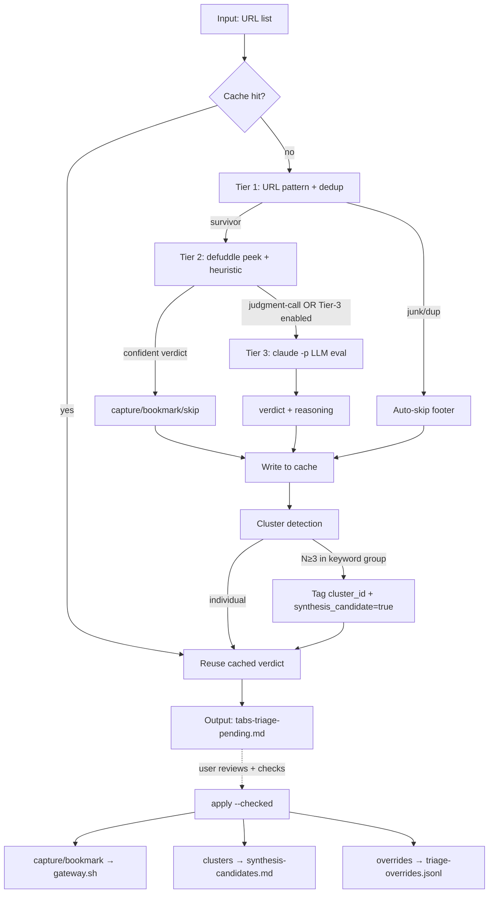

# Content-Aware URL Triage — Design Spec (v2)

Заменяет URL-pattern-only scoring системы триажа на content-aware judgment с per-domain bars и tiered eval depth. Output: per-URL verdict (`capture` / `bookmark` / `skip`) с optional `cluster_id` + `synthesis_candidate` flags, готовый к batch execution с минимальным ревью.

**v2 changes от v1:** synthesis-seed decoupled (был exclusive verdict с data-loss risk → orthogonal flag); bookmark routed through gateway (был direct write → нарушало Library/Brain invariant); checkpointing/cache добавлен; action executor promoted в MVP (был incremental → MVP без него violates "минимизировать мою работу"); calibration loop добавлен; evidence snippets в output doc; cluster algorithm уточнён (title + lead paragraph, no overengineering); file hygiene specified per artifact.

## TL;DR

> [!decision] 6 архитектурных решений (v2)
> 1. **Verdict shape** — triplet `capture` / `bookmark` / `skip` + orthogonal `cluster_id` + `synthesis_candidate` flags (не quadrant — synthesis-seed раньше был exclusive verdict с data-loss risk).
> 2. **Bar = function of domain** — high-bar (mc/strategy, inner-work, mc/people, mc/legal, finance, relationships, culture, home) vs medium-bar (mc/product, mc/engineering, mc/operations, mc/growth, mc/ai, career, learning, health, influence). Same substance score → разный verdict в зависимости от bar.
> 3. **Eval depth = adaptive tiered** — Tier 1 metadata (5s/URL, all) → Tier 2 content peek (15-30s/URL, survivors) → Tier 3 LLM judgment (1-2min/URL, judgment-call cases only). MVP ships Tier 1+2; Tier 3 incremental.
> 4. **Cluster detection = auto, post-Tier-2** — Jaccard на (title + lead paragraph keywords), N≥3 → flag cluster (NOT override verdict).
> 5. **Action executor IN MVP** — `triage-urls.py apply --checked` parses output doc, dispatches capture/bookmark/cluster-registry actions. Без executor MVP — это просто markdown doc, не "minimize work."
> 6. **Calibration loop** — override-tracking в `_claude/triage-overrides.jsonl`, future runs surface drift в header. Self-tuning per-domain bars over time.

> [!implementation] Что строим
> `~/Mnemon/bin/triage-urls.py` — standalone Python CLI с `evaluate` и `apply` subcommands. Reuses defuddle (Tier 2 fetch), `claude -p` (Tier 3 only), `knowledge-gateway.sh` (capture + bookmark execution).
> + Modify `knowledge-gateway.sh` to add `--source-type bookmark --skip-extract` path (~2h).
> Effort: **~3-4 days** MVP (Tiers 1+2 + cluster + output doc + executor + calibration loop). Tier 3 LLM incremental.



---

## Decisions

### D1 — Verdict triplet + orthogonal cluster flags (REVISED from v1)

> [!decision] `capture` / `bookmark` / `skip` + `cluster_id` + `synthesis_candidate`
> v1 had quadrant с `synthesis-seed` as 4th verdict overriding individual decisions. Council found this was data-loss bug: cluster member that should be captured could be re-tagged synthesis-seed → no source.md/extract.md ever written → cluster registry references nonexistent artifacts.

**What it looks like:**

| Verdict | Action | Knowledge artifact |
|---|---|---|
| `capture` | Full gateway run (`source-add`) | `source.md` + `extract.md` via gateway |
| `bookmark` | Gateway with `--skip-extract` flag | `source.md` only (no extract.md) via gateway |
| `skip` | No action | None |

**Orthogonal flags (apply to any verdict):**
- `cluster_id` (string, optional) — присваивается если URL part of detected cluster
- `synthesis_candidate=true` (bool, default false) — присваивается если cluster size ≥ 3

**Action on `synthesis_candidate=true`:** append cluster entry to `_claude/synthesis-candidates.md` (registry), **but underlying capture/bookmark action still executes**. Cluster membership *enriches* the verdict, never *replaces* it.

> [!risk] Trade-off accepted
> Triplet vs quadrant: less expressive at verdict level, but eliminates the data-loss class entirely. Clusters live in metadata, not in main verdict dimension.

### D2 — Per-domain bars (variable threshold) — calibration loop added

> [!decision] High-bar (8 domains) vs Medium-bar (9 domains) + self-tuning via override log
> Same substance score → разный verdict в зависимости от domain'а. mc/ai repo substance-3 → bookmark; culture URL substance-3 → skip.

**HIGH-bar domains:** `mc/strategy`, `mc/legal`, `mc/people`, `inner-work`, `finance`, `relationships`, `culture`, `home`

**MEDIUM-bar domains:** `mc/product`, `mc/engineering`, `mc/operations`, `mc/growth`, `mc/ai`, `career`, `learning`, `health`, `influence`

**Verdict matrix:**

| Substance score | HIGH-bar | MEDIUM-bar |
|---|---|---|
| 5 (rich key idea / framework) | capture | capture |
| 4 (substantive content) | bookmark | capture |
| 3 (moderate substance) | skip | bookmark |
| 1-2 (thin / aggregator / marketing) | skip | skip |

**Calibration loop (NEW v2):** every manual override at `apply` step appends to `_claude/triage-overrides.jsonl`:
```jsonl
{"url": "...", "verdict_proposed": "skip", "verdict_chosen": "capture", "domain": "mc/ai", "substance": 3, "date": "2026-06-15"}
```

Each subsequent triage run reads this log and surfaces drift patterns в header:
```
⚠ Calibration drift detected (last 30 days):
  - mc/ai substance-3 overridden skip→capture in 7/10 cases
    → suggest moving mc/ai to medium-bar bottom (currently bookmark@3, consider capture@3)
```

Drift suggestions are read-only — Dima decides whether to amend bar table. The system never auto-amends config.

### D3 — Tiered adaptive evaluation depth

> [!decision] 3-tier pipeline, expensive ops only when needed
> Tier 1 metadata → Tier 2 content peek → Tier 3 LLM. Adaptive: each URL traverses only as deep as needed.

**Tier 1 — Metadata (~5s/URL, all URLs):**
- Parse URL pattern (host, path, deeplink check)
- Knowledge dedup (URL normalize + lookup against `Sources/*/source.md` `url:` field)
- Hard skip rules (junk/auth/lifestyle/duplicate — see "Hard-skip patterns" below)
- Output: `skip-dup`, `skip-junk`, or `needs-tier-2`

**Tier 2 — Content peek (~15-30s/URL, Tier-1 survivors):**
- `defuddle parse <url> --md` → first ~500 words + headers + meta
- Extract: language, content length, link density, structural markers (h1/h2, code blocks, lists)
- Domain classification: host heuristic + content-keyword overlay → **with confidence score** (NEW v2)
- Heuristic substance score (1-5)
- Cheap agenda fit: keyword overlap vs Personal Context Agenda + per-domain framing
- Output: confident verdict OR `needs-tier-3`

**Tier 3 — LLM judgment (~1-2min/URL, judgment-call cases):**
- `claude -p` with template prompt: content excerpt + Personal Context Agenda + per-domain bar + 2-3 sample Knowledge sources в domain → verdict + reasoning
- Escalation triggers (REFINED v2 from "no agenda signal"):
  - Substance band 3 (the verdict-boundary band in matrix)
  - Domain classification confidence < threshold
  - Defuddle fetch failed AND URL pattern suggests substance
  - Cluster cardinality ambiguous (2-3 items, on borderline)
- **Cap: 30 URLs per run** to bound cost; excess degrade to `needs-investigation` bucket in output
- MVP ships without Tier 3 (Tier 2 makes confident verdict for "investigate" bucket; Dima manually reviews those)

**Estimated runtime for 101 URLs (MVP, no Tier 3):**
- 35 auto-skip @ Tier 1: ~3 min
- 60 Tier-2 confident verdicts: ~20 min
- 6 needs-investigation (Tier-2 ambiguous, no Tier 3 in MVP): instant
- **Total: ~25 min background**

**With Tier 3 (post-MVP increment):**
- 6 Tier-3 LLM evals: ~10 min
- **Total: ~35 min background**

### D4 — Cluster detection (auto, orthogonal flags)

> [!decision] Heuristic clustering — title + lead paragraph keywords (REVISED v2)
> v1 was title-only — too sparse. v2 uses title + first defuddle paragraph (already fetched in Tier 2, zero extra cost). Council reviewers warned against overengineering (don't add meta tags, H1/H2 deep extraction, GitHub topics — diminishing returns for heuristic tier).

**Algorithm:**
1. For each URL post-Tier-2: extract keywords from `title + first_paragraph_500_words`
   - Tokenize, lowercase, strip punctuation
   - Filter: stopwords (English + Russian), min length 4, skip pure numbers
2. Group items by primary domain (from Tier 2 classification)
3. Within each domain group: pairwise Jaccard similarity on keyword sets
4. Single-linkage cluster at threshold 0.4
5. Cluster size ≥3 → **tag all members with `cluster_id=<auto-named>` + `synthesis_candidate=true`** (orthogonal to verdict — does NOT change verdict)
6. Generate cluster name from common keywords; suggest synthesis angle (1-line stub)

**Example:** 5 URLs в `mc/ai` с shared keywords {"agent", "skill", "claude-code"} → cluster `agent-skills-claude-code` (5 items), suggested: "Comparison of Claude Code agent-skill systems". Individual verdicts preserved (some capture, some bookmark, some skip — but all flagged as cluster members).

### D5 — Action executor IN MVP (NEW v2 — promoted from incremental)

> [!decision] MVP includes `triage-urls.py apply --checked`
> v1 deferred executor to "incremental." Council unanimously: without executor, MVP produces a markdown TODO list that user clicks through manually — violates "минимизировать мою работу." Promoted into MVP. Trade-off: defer Tier 3 LLM.

**Apply subcommand:**
```bash
~/Mnemon/bin/triage-urls.py apply [--vault PATH] [--dry-run]
```

Behavior:
1. Read `_claude/tabs-triage-pending.md`, parse all `- [x]` checkboxes per verdict section
2. For each `[x]` `capture` item → invoke `knowledge-gateway.sh source-add --origin url --url "..."`
3. For each `[x]` `bookmark` item → invoke `knowledge-gateway.sh source-add --origin url --url "..." --source-type bookmark --skip-extract`
4. For each `[x]` cluster entry → append to `_claude/synthesis-candidates.md` registry (cluster name, items list, suggested angle, date)
5. For each item where verdict was overridden (e.g., proposed `skip` but `[x]`-marked under `capture`) → append entry to `_claude/triage-overrides.jsonl`
6. After all actions: rename processed `tabs-triage-pending.md` → `_claude/triage-history/<timestamp>.md` (audit trail), leave clean state for next run

**Markdown parser contract (defensive):**
- Recognized syntax: `- [x] **Title**\n  \`url\`\n  *reason* · ...`
- Malformed line → log to stderr, skip (don't fail batch)
- User-added inline comments after URL → preserved in override log if action triggered
- Empty input or no checked items → no-op, exit 0

### D6 — Bookmark via gateway (NEW v2 — was direct write)

> [!decision] Bookmark routes through `knowledge-gateway.sh --source-type bookmark --skip-extract`
> v1 had bookmark writing source.md directly, bypassing gateway. Council: violates Library/Brain single-write-authority invariant from vault-charter. Direct writes miss: hash naming, URL normalization, dedup, L1 archive, reindex hook, pending-writes recovery.

**Implementation requires gateway modification (~2h):**

```bash
# New gateway flags
knowledge-gateway.sh source-add \
  --origin url --url "https://..." \
  --source-type bookmark \
  --skip-extract
```

Gateway behavior with `--skip-extract`:
- Run dedup, URL normalize, hash, L1 archive as usual
- Create folder `Sources/<date>_<hash>/`
- Write source.md with `source_type: bookmark`, `content_format: reference`, 1-line `triage_note:` field
- **Skip claude -p invocation** (no extract.md generated)
- Trigger reindex hook (so index.md picks up new entry)

**Bookmark source.md template:**
```yaml
---
type: source
source_type: bookmark
content_format: reference
origin: url
url: "<normalized-url>"
author: ""
captured: <YYYY-MM-DD>
captured_by: agent
triage_note: "<1-line Tier-2 verdict reasoning>"
---

# <title>

<first ~200 chars from defuddle, if available>
```

---

## Implementation

> [!implementation] 7 шагов · ~3-4 days MVP · executor included
> v2 promotes executor + cache into MVP. Tier 3 LLM deferred to incremental.

### Build sequence

| Step | Effort | What |
|---|---|---|
| 1 | 2h | Modify `knowledge-gateway.sh`: add `--source-type bookmark --skip-extract` path. Test on 1 URL. |
| 2 | 3h | Tier 1 pipeline в `triage-urls.py evaluate`: URL normalize, Knowledge dedup index, hard-skip rules, per-URL cache in `_claude/triage-cache/<sha8>.json` (skip on re-run if cache hit). |
| 3 | 4h | Tier 2 pipeline: defuddle integration, heuristic substance scoring, domain classification with confidence, agenda-keyword match. Cache results. |
| 4 | 3h | Cluster detection post-pass. Keyword extraction (title + first paragraph), Jaccard grouping, cluster naming. Tag orthogonal flags, не override verdict. |
| 5 | 3h | Output doc generation: verdict sections with Obsidian foldable callouts, pre-checked verdicts, calibration drift header, evidence snippets per item, summary stats. |
| 6 | 4h | Action executor (`triage-urls.py apply`): markdown parser, dispatch to gateway/synthesis-candidates/override-log. Defensive parser contract. Audit-trail rename to `triage-history/`. |
| 7 | 2h | Calibration loop integration: read `triage-overrides.jsonl` at run start, compute drift patterns, surface in output header. |
| **+ incr** | 4h | Tier 3 LLM: `claude -p` subprocess, prompt template, escalation conditions, N=30 cap. |

**MVP total: ~21h ≈ 3 days focused work.** Tier 3 incremental adds ~4h.

### Test matrix

| Test | What verifies |
|---|---|
| Run `evaluate` on `_claude/tabs-triage-pending.md` (101 items) | End-to-end Tier 1+2, produces enriched doc, verdicts plausible |
| Re-run `evaluate` on same input | Cache hits, no re-fetch, identical output |
| Mid-batch SIGTERM, then resume | Cache persists, completed URLs skipped, batch picks up where killed |
| Tier 1 auto-skip rate | ~30-40% (junk/dup/lifestyle) |
| Cluster detection | Manually-known cluster (5 agent-skill repos) auto-detected, members keep individual verdicts + get cluster_id |
| Knowledge dedup hit | URLs уже в Knowledge → skip-dup correctly |
| `apply --checked` on output | All checked items execute (gateway calls / registry appends / override log); unchecked items NO-OP |
| `apply --dry-run` | Shows what would happen, no side effects |
| Malformed markdown (typo in checkbox, missing URL line) | Parser logs to stderr, skips item, doesn't fail batch |
| Calibration drift after 20+ overrides | Header surfaces "domain X: substance Y overridden N times" pattern |
| Empty input (0 URLs) | No-op, exit 0 |
| Reader Context > staleness threshold | Header warns "Personal Context is X days stale; verdicts may be miscalibrated" |

---

## File touch surface

**Created (Mnemon repo):**
- `~/Mnemon/bin/triage-urls.py` (main script с `evaluate` + `apply` subcommands)
- `~/Mnemon/templates/triage-prompt.md` (Tier 3 LLM template — incremental)
- `~/Mnemon/docs/specs/2026-05-31-content-aware-url-triage.md` (this spec)

**Modified (Mnemon repo):**
- `~/Mnemon/bin/knowledge-gateway.sh` (+ `--source-type bookmark --skip-extract` path, ~10-15 LoC)

**Created/modified (vault `_claude/`):**

| File | Lifecycle | Cleanup policy |
|---|---|---|
| `tabs-triage-pending.md` | Overwritten each `evaluate` run | Renamed to `triage-history/<ts>.md` after `apply`; left clean |
| `triage-cache/<sha8>.json` | Append-only per URL | Deleted on successful `apply` (cache = transient); 30-day TTL for orphans |
| `synthesis-candidates.md` | Append on `apply` | Pruned when Synthesis note written OR 90-day TTL on stale entries |
| `triage-overrides.jsonl` | Append-only on `apply` | Compacted by `triage-urls.py calibrate-tune` (post-MVP) reading last 90 days |
| `triage-history/*.md` | Created on each `apply` | 6-month TTL (manual) for audit trail |

**Read-only (vault):**
- `<vault>/Sources/*/source.md` (Knowledge dedup index)
- `<vault>/_meta/Protocol.md` (domain registry)
- `<vault>/CLAUDE.md` (Reader Context)
- `~/Obsidian/Shared/Context/Personal Context.md` (live agenda)
- `~/Obsidian/Shared/Context/First Principles.md` (secondary framing)

---

## Hard-skip patterns (explicit reference)

| Pattern class | Examples |
|---|---|
| Junk | `google.com/search`, `bing.com/search`, `duckduckgo.com/`, `chatgpt.com/`, `claude.ai/{chat,new,artifacts,recents}`, `t.me/*bot` |
| Auth-flow | URL contains `/login`, `/signin`, `/signup`, `/auth`, `/account`, `/dashboard`, `/checkout`, `/cart` |
| Lifestyle / transactional | `*.hotels.com`, `sirhotels.com`, `airbnb.*`, `booking.com`, `amazon.*`, `kitkat*`, `sothebysrealty.*`, `bestproductsreviews.*`, `getcourse.ru`, `luma.com` |
| Duplicate | Normalized URL exists in `<vault>/Sources/*/source.md` `url:` field |
| Deeplink | `github.com/.../{blob,tree,commit,issues,pull,wiki,releases}/...` |

Constants live in `triage-urls.py` as module-level config.

---

## Deferred / out of scope

| Item | Why deferred |
|---|---|
| Tier 3 LLM (incremental) | Trade-off vs executor in MVP; Tier 2 confident verdict for most cases |
| Auto-execute без review | Risk асимметричен (undo capture = real work); manual confirm safer |
| Web UI / interactive TUI | Obsidian checkbox edit достаточно |
| Continuous tab monitoring | Manual trigger only |
| ML/embedding-based semantic dedup | URL normalize + keyword cluster покрывает 90%+ |
| Cross-device tab reading в этой системе | Triage работает с любым URL list — device source — upstream concern |
| Synthesis note auto-generation | Per protocol: human-only. System только seeds candidates registry. |
| Authenticated web fallback (browser cookies, headless browser) | Tier 2 fetch failure → mark `needs-auth` verdict in output; v2 concern |
| Prompt-injection isolation для Tier 3 page excerpts | Defer to Tier 3 implementation phase |
| Path B (gateway --triage-only mode unification) | v2 architectural question after MVP usage stabilizes |
| Automated config tuning (auto-amend per-domain bars) | System only surfaces drift; human decides. AI does filing, human does thinking. |

## Open / waiting

- Tier 3 confidence threshold — tuning by usage. Start at substance-3 + domain-confidence < 0.7.
- Cluster Jaccard threshold — start 0.4, adjust based on false positive rate.
- "Минимизировать мою работу" success metric — proposed: `(seconds reviewing) / (URLs processed) < 2s/URL` after pre-check defaults. Measure during MVP usage.

---

## Status

V2 spec, ready for review. v2 integrates Nestor council review + own engineering:architecture pass. MVP scope expanded (executor + cache + calibration loop in), but still tractable (~3 days). Mnemon repo as build location. Reuses existing infra (defuddle, claude -p, knowledge-gateway.sh + minor mod).

---

## Appendix A — Design dialogue audit trail

| Decision | Options considered | Chosen v1 | Chosen v2 | Why changed |
|---|---|---|---|---|
| Bar setting | High / Medium / Low / Variable | Variable per domain | (unchanged) | — |
| Verdict shape | Binary / Tiered / Quadrant | Quadrant (capture/bookmark/synthesis-seed/skip) | **Triplet + orthogonal flags** | Council: synthesis-seed override = data-loss bug |
| Eval depth | Metadata-only / Tiered / LLM-per-URL | Tiered adaptive | (unchanged) | — |
| Cluster detection | Off / Auto-heuristic / LLM-driven | Auto, title Jaccard | **Auto, title+lead Jaccard, orthogonal tag** | Title-only too sparse (council unanimous); cluster never overrides verdict |
| Bookmark write path | Direct / via gateway | Direct | **Via gateway --skip-extract** | Council: direct write violates Library/Brain invariant |
| Action executor | Incremental post-MVP / in MVP | Incremental | **In MVP** | Without executor MVP = markdown TODO list, violates "минимизировать мою работу" |
| State recovery | Not addressed / per-URL cache | Not addressed | **Per-URL JSON cache** | 50-min batches will fail (empirically confirmed in our 71-min batch this session) |
| Calibration | None / manual / auto-tune | None | **Override log → drift surface in header** | Stage-2 catch: static rules ossify, "minimize work" degrades silently |
| Evidence snippets | None / per item | None | **1-line excerpt per verdict** | Stage-2 catch: without snippets, user re-opens URLs to trust verdicts |
| File hygiene | Implicit | Implicit | **Explicit per file, with TTL** | Multiple new working-state files = new hygiene burden |

## Appendix B — Reuse of existing infrastructure

| Component | What we reuse |
|---|---|
| URL normalization | Algorithm from triage doc rebuild (strip tracking, lowercase). Refactor: extract to `~/Mnemon/bin/lib-url.py`, import in both `triage-urls.py` and (eventually) sourced into `knowledge-gateway.sh` to prevent parsing drift (Gemini stage-1 catch). |
| Knowledge dedup | Same source.md URL scan from `knowledge-reindex.py` |
| Content fetch | `defuddle parse` (NEW dependency for triage; gateway uses WebFetch via claude — different path) |
| LLM eval | `claude -p` subprocess (same pattern as gateway extract) — Tier 3 incremental |
| Capture execution | `knowledge-gateway.sh source-add` (existing) + new `--source-type bookmark --skip-extract` (~2h modification) |
| Reindex after capture | Existing post-success hook (auto-fires for both capture and bookmark) |

## Appendix C — v1 → v2 review history

**v1 written:** 2026-05-31, ~3 hours, after brainstorming dialogue with Dima.

**Review process:** Nestor council via `pal.consensus` — deliberative mode, arch preset (Opus 4.7 + Gemini 3.1-pro + GPT-5.5-pro), all-neutral stances. Stage 1: 3 first-round answers. Stage 2: 3 parallel anonymised cross-critiques. Plus own engineering:architecture pass for session-aware qualifications.

**Convergent findings (unanimous stage 1):**
1. synthesis-seed override is data-loss bug
2. Bookmark bypass violates gateway invariant
3. No state recovery / checkpointing
4. Title-only Jaccard too sparse
5. Action executor must be in MVP
6. Output needs collapsible UX

**Stage-2 catches (independent blindspots — NEW signal):**
A. Calibration / feedback loop missing (Opus + GPT-5)
B. False-skip vs false-capture asymmetry (Opus)
C. Authenticated web reality — paywalls, login pages (Gemini)
D. Markdown state parsing fragility (Gemini)
E. Prompt-injection on fetched Tier 3 content (GPT-5)
F. Evidence snippets needed in output doc (GPT-5)
G. "Минимизировать мою работу" needs measurable metric (GPT-5)

**Session-aware qualifications (own pass):**
- Reader Context staleness check ALREADY exists in Protocol.md:79 — reuse, not new mechanism
- "1-2 day MVP" estimate empirically aligned with our own 71-min 24-URL batch this session — realistic at 3-4 days with v2 additions
- Knowledge has existing `source_type: bookmark` precedent (Thousand Brains channel) — bookmark schema not new, just under-specified before
- New working-state surface area = 4 files; explicit TTL/cleanup per file specified

**v2 integrates:** all 6 unanimous fixes (MUST), 4 of 7 stage-2 catches (calibration loop, evidence snippets, file hygiene + reuse Reader staleness check, URL normalize lib refactor). Deferred: 3 stage-2 catches (auth web fallback, markdown parser hardening, prompt-injection isolation) into "Deferred / out of scope" with clear rationale.

**Confidence after v2:** high (8.5/10) on architectural soundness; lower on actual user-time-savings (which is empirical, measurable only at MVP usage).
