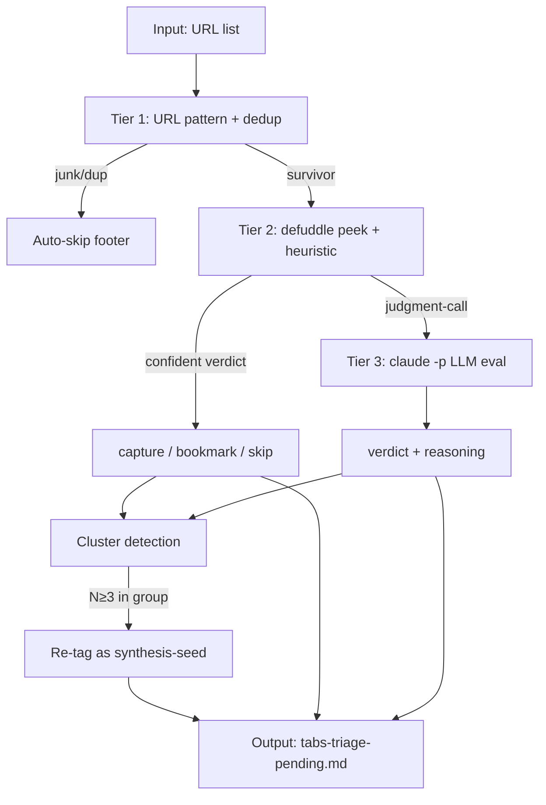

# Content-Aware URL Triage — Design Spec

Заменяет URL-pattern-only scoring системы триажа на content-aware judgment с per-domain bars и tiered eval depth. Output: per-URL verdict (capture / bookmark / synthesis-seed / skip) с reasoning, готовый к batch execution с минимальным ревью.

## TL;DR

> [!decision] 4 архитектурные решения
> 1. **Verdict shape** — quadrant: `capture` / `bookmark` / `synthesis-seed` / `skip` (не binary, не linear)
> 2. **Bar = function of domain** — high-bar (mc/strategy, inner-work, finance, culture, home, mc/people, mc/legal, relationships) vs medium-bar (остальные 9 domains). Same substance score → разный verdict в зависимости от bar.
> 3. **Eval depth = adaptive tiered** — Tier 1 metadata (5s/URL, all) → Tier 2 content peek (15-30s/URL, survivors) → Tier 3 LLM judgment (1-2min/URL, judgment-call cases only).
> 4. **Cluster detection = auto, post-Tier-2** — group by (domain × shared title keywords); N≥3 → re-tag whole cluster as synthesis-seed.

> [!implementation] Что строим
> `~/Mnemon/bin/triage-urls.py` — standalone CLI, читает list of URLs, запускает 3-tier pipeline + cluster detection, пишет `_claude/tabs-triage-pending.md` с verdict per item.
> Reuses existing infrastructure: defuddle (content fetch), `claude -p` (LLM eval), `knowledge-gateway.sh` (capture execution).
> Effort: **~1-2 days** для MVP (Tier 1+2 + cluster + output doc). Tier 3 LLM integration — incremental добавление.



---

## Decisions

### D1 — Verdict quadrant (not binary)

> [!decision] 4 verdict types covering capture/bookmark/seed/skip
> Binary "capture or skip" теряет nuance. Quadrant даёт graduated response: full extract (capture), lightweight pointer (bookmark), deferred cluster (synthesis-seed), or no action (skip).

**What it looks like:**

| Verdict | Action | Knowledge artifact |
|---|---|---|
| `capture` | Full gateway run (`source-add`) | `source.md` + `extract.md` |
| `bookmark` | Direct write, no gateway | `source.md` only, `source_type: bookmark`, no `extract.md` |
| `synthesis-seed` | Append to registry | Entry in `_claude/synthesis-candidates.md` (cluster + suggested angle) |
| `skip` | No action | None |

**Why:** Existing `source_type: bookmark` уже работает в vault (видел Thousand Brains YouTube channel). Synthesis-seed соответствует протокольному правилу "AI doesn't write Synthesis autonomously — suggests" — registry даёт human-readable queue без нарушения границы.

> [!risk] Trade-off accepted
> Quadrant сложнее scanning (4 buckets вместо 2). Mitigated by: pre-checked default checkboxes (no choosing needed), per-section "uncheck all" markers, cluster-level single-checkbox decisions.

### D2 — Per-domain bars (variable threshold)

> [!decision] High-bar (8 domains) vs Medium-bar (9 domains)
> Same substance score даёт разный verdict в зависимости от domain'а. mc/ai repo substance-3 → bookmark; culture URL substance-3 → skip.

**HIGH-bar domains (curate tightly):**
- `mc/strategy`, `mc/legal`, `mc/people`
- `inner-work`, `finance`, `relationships`, `culture`, `home`

**MEDIUM-bar domains (active capture):**
- `mc/product`, `mc/engineering`, `mc/operations`, `mc/growth`, `mc/ai`
- `career`, `learning`, `health`, `influence`

**Verdict matrix:**

| Substance score | HIGH-bar | MEDIUM-bar |
|---|---|---|
| 5 (rich key idea / framework) | capture | capture |
| 4 (substantive content) | bookmark | capture |
| 3 (moderate substance) | skip | bookmark |
| 1-2 (thin / aggregator / marketing) | skip | skip |

**Why:** mc/strategy и inner-work — стратегические curated layer'ы (Dima's hint). Learning/tools — active investigation domain (broad collection OK). Culture/home — редко достойны Knowledge (experienced not archived).

### D3 — Tiered adaptive evaluation depth

> [!decision] 3-tier pipeline, expensive ops только когда нужны
> Не запускать LLM на каждый URL. Cheap pass first; expensive только на judgment-call cases.

**Tier 1 — Metadata (~5s/URL, all URLs):**
- Parse URL pattern (host, path, deeplink check)
- Knowledge dedup check (URL normalize + lookup)
- Hard skip rules (junk: search/chat/bot; auth/checkout; lifestyle/transactional)
- Output: `skip-dup`, `skip-junk`, или `needs-tier-2`

**Tier 2 — Content peek (~15-30s/URL, Tier-1 survivors):**
- `defuddle parse <url> --md` → first ~500 words + headers + meta
- Extract: language, content length, link density, structural markers (h1/h2, code blocks, lists)
- Domain classification: host heuristic + content-keyword overlay
- Heuristic substance score (1-5)
- Cheap agenda fit: keyword overlap vs Personal Context Agenda + per-domain framing
- Output: confident verdict OR `needs-tier-3`

**Tier 3 — LLM judgment (~1-2min/URL, judgment-call cases):**
- `claude -p` with template prompt: content excerpt + Personal Context Agenda + per-domain bar + 2-3 sample Knowledge sources в domain → verdict + reasoning paragraph
- Used когда Tier-2 confidence < threshold (default: ambiguous substance 3-4 with no strong agenda signal)
- Expected ~20% of URLs

**Estimated runtime for 101 URLs:**
- 35 auto-skip @ Tier 1: ~3 min
- 50 Tier-2-confident: ~20 min
- 16 Tier-3 LLM: ~25 min
- **Total: ~50 min background**

### D4 — Cluster detection (auto, post-Tier-2)

> [!decision] Heuristic cluster detection — no LLM
> После Tier 2 у нас есть domain + topic keywords для каждого URL'а. Group by (domain + 2+ shared keywords) → N≥3 = synthesis-seed cluster.

**Algorithm:**
1. For each URL, extract topic keywords from title (TF-IDF-ish or simple noun extraction)
2. Group items by domain (primary domain assignment)
3. Within each domain group: cluster by Jaccard similarity on keywords (threshold ~0.4)
4. Cluster size ≥3 → re-tag all members as `synthesis-seed` (override individual verdict)
5. Generate cluster name from common keywords
6. Suggest synthesis angle (1-line stub for human review)

**Example:** 5 URLs в `mc/ai` с shared keywords {"agent", "skill", "claude-code"} → cluster `agent-skills-claude-code` (5 items), suggested: "Comparison of Claude Code agent-skill systems".

**Why no LLM:** keyword-based clustering достаточно для obvious clusters; LLM-driven cluster detection adds 30+ min compute для marginal accuracy gain.

---

## Implementation

> [!implementation] 4 шага · ~1-2 days · MVP first
> Tier 1+2 + output doc первая итерация. Tier 3 LLM + cluster detection — следующий incremental.

### Build sequence

| Step | Effort | What |
|---|---|---|
| 1 | 2-3h | Tier 1 pipeline: URL normalize, Knowledge dedup index, hard-skip rules. Output: classification + remaining set. |
| 2 | 3-4h | Tier 2 pipeline: defuddle integration, heuristic substance scoring, domain classification, agenda-keyword match. Output: per-item verdict. |
| 3 | 2-3h | Cluster detection post-pass. Keyword extraction, Jaccard grouping, cluster naming. |
| 4 | 2-3h | Output doc generation: verdict sections, pre-checked boxes, summary, auto-skip footer. |
| 5 (incremental) | 3-4h | Tier 3 LLM integration: `claude -p` subprocess, prompt template, fallback handling, confidence threshold tuning. |
| 6 (incremental) | 2-3h | Action executor: "выполни отмеченные" parser — capture/bookmark/synthesis-seed dispatch. |

**MVP (steps 1-4) ships triage без LLM judgment.** Tier 2 heuristic делает confident verdict в ~80% случаев; остальные 20% помечаются `needs-tier-3` и в MVP идут в "investigate" bucket для human eyes. Tier 3 LLM добавляется incremental когда heuristic shows insufficient.

### Test matrix

| Test | What verifies |
|---|---|
| Run on current 101 URLs | End-to-end: produces enriched doc, verdicts plausible |
| Auto-skip rate | ~30-40% caught at Tier 1 (junk/dup/lifestyle) |
| Cluster detection | Manually-known cluster (5 agent-skill repos) auto-detected |
| Verdict distribution | Не доминирует один verdict (т.е. распределение разумное по 4-м buckets) |
| Idempotent re-run | Те же URLs → тот же output (modulo Personal Context Agenda drift) |
| Knowledge dedup hit | URLs уже в Knowledge → skip-dup correctly |

---

## File touch surface

**Created:**
- `~/Mnemon/bin/triage-urls.py` (main script)
- `~/Mnemon/templates/triage-prompt.md` (Tier 3 LLM template)
- `~/Mnemon/docs/specs/2026-05-31-content-aware-url-triage.md` (this spec)

**Modified:**
- `<vault>/_claude/tabs-triage-pending.md` (overwritten on each run)
- `<vault>/_claude/synthesis-candidates.md` (appended during action execution)

**Read-only:**
- `<vault>/Sources/*/source.md` (Knowledge dedup index)
- `<vault>/_meta/Protocol.md` (domain registry)
- `<vault>/CLAUDE.md` (Reader Context)
- `~/Obsidian/Shared/Context/Personal Context.md` (live agenda)
- `~/Obsidian/Shared/Context/First Principles.md` (secondary framing)

---

## Deferred / out of scope

| Item | Why deferred |
|---|---|
| Auto-execute high-confidence без review | Risk асимметричен — undo capture = real work; manual confirm safer |
| Web UI / interactive TUI | Obsidian checkbox edit достаточно |
| Continuous tab monitoring | Manual trigger only; tabs query происходит when user invokes |
| ML/embedding-based semantic dedup | URL normalize + keyword cluster покрывает 90% случаев |
| Cross-device tab reading в этой системе | Triage работает с любым URL list — device source решается upstream |
| Synthesis note auto-generation | Per protocol: human-only. System только seeds candidates registry. |

## Open / waiting

- Tier 3 confidence threshold — tuning by usage. Start at substance 3-4 + no strong agenda match → promote to Tier 3.
- Cluster Jaccard threshold — start 0.4, adjust based on false positive rate.

## Bookmark `source.md` template (concrete)

```yaml
---
type: source
source_type: bookmark
content_format: reference
origin: url
url: "<normalized-url>"
author: ""            # optional, if surfaced cheaply by Tier 2
captured: <YYYY-MM-DD>
captured_by: agent
triage_note: "<1-line Tier-2 verdict reasoning, e.g. 'product-homepage, mc/ai domain, kept findable'>"
---

# <title>

<one paragraph from defuddle first ~200 chars, if available>
```

No `extract.md` is written. Bookmark is intentionally light — represents "findable pointer", not "thinking artifact".

## Hard-skip patterns (explicit reference)

| Pattern class | Examples |
|---|---|
| Junk | `google.com/search`, `bing.com/search`, `duckduckgo.com/`, `chatgpt.com/`, `claude.ai/{chat,new,artifacts,recents}`, `t.me/*bot` |
| Auth-flow | URL contains `/login`, `/signin`, `/signup`, `/auth`, `/account`, `/dashboard`, `/checkout`, `/cart` |
| Lifestyle / transactional | Hosts: `*.hotels.com`, `sirhotels.com`, `airbnb.*`, `booking.com`, `amazon.*`, `kitkat*`, `sothebysrealty.*`, `bestproductsreviews.*`, `getcourse.ru`, `luma.com`, hotel/event/shopping equivalents |
| Duplicate | Normalized URL exists in `<vault>/Sources/*/source.md` `url:` field |
| Deeplink | `github.com/.../{blob,tree,commit,issues,pull,wiki,releases}/...` (capture only repo root, not specific files) |

These rule constants live in `triage-urls.py` as module-level config — easy to amend without re-versioning the spec.

## Status

V1 spec, ready for review. Mnemon repo as build location. Reuses existing infrastructure (defuddle, claude -p, knowledge-gateway.sh). MVP scope (Tier 1+2 + output) deliverable in 1-2 days. Tier 3 + actions added incrementally based on usage.

---

## Appendix A — Design dialogue audit trail

| Decision | Options considered | Chosen | Why |
|---|---|---|---|
| Bar setting | High / Medium / Low / Variable | Variable per domain | Different domains have different signal-to-noise characteristics |
| Verdict shape | Binary / Tiered / Quadrant | Quadrant | Adds bookmark (lightweight) and synthesis-seed (cluster) verdict types |
| Eval depth | Metadata-only / Tiered / LLM-per-URL | Tiered adaptive | Best accuracy-per-compute ratio; LLM only when needed |
| Cluster detection | Off / Auto-heuristic / LLM-driven | Auto, post-Tier-2 | No extra compute; obvious clusters caught |

## Appendix B — Reuse of existing infra

| Component | What we reuse |
|---|---|
| URL normalization | Algorithm from triage doc rebuild (strip tracking, lowercase) |
| Knowledge dedup | Same source.md URL scan from reindex.py |
| Content fetch | `defuddle parse` (already used in gateway) |
| LLM eval | `claude -p` subprocess (same pattern as gateway extract) |
| Capture execution | `knowledge-gateway.sh source-add` (existing gateway) |
| Reindex after capture | Existing post-success hook (auto-fires) |
